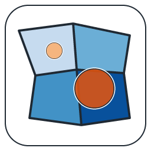
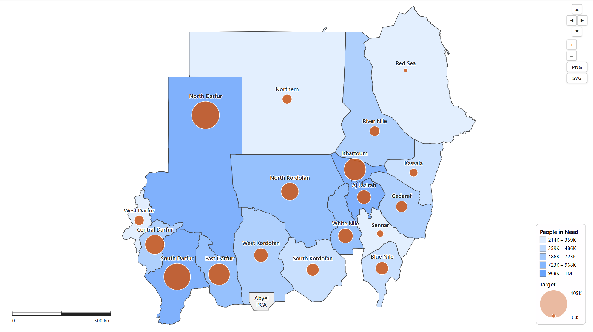
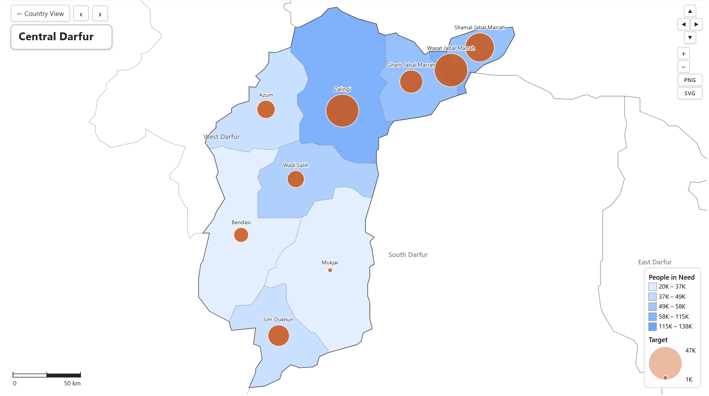

# AdminCartograph

A Power BI custom visual for **multi-layer subnational maps**.
Upload your country's GeoJSON or TopoJSON, bind a PCODE column, and
get choropleth fills, bubbles, and pie / donut / column overlays with
drill-down between Admin1 and Admin2.



## What it looks like

> 📸 *Real-data screenshots go here. Drop PNGs into
> `assets/screenshots/` with the filenames listed below and the
> README will pick them up.*





| File | What to capture |
|---|---|
| `01-hero.png` | Full-canvas Admin1 view: choropleth + bubbles + labels visible, value legend in a corner |
| `02-format-pane.png` | Format pane open with the 14 numbered cards visible |
| `03-three-layers.png` | Choropleth + bubbles + donut overlay all active |
| `04-drill.png` | Drill view: title pill top-left, prev/next arrows, focused state's Admin2 polygons |
| `05-custom-upload.png` | Custom upload card with the field-mapping dropdowns populated |
| `06-powerpoint.png` | A PowerPoint slide with the exported A5 PNG inserted |

See [`assets/screenshots/README.md`](assets/screenshots/README.md) for
how to capture each shot in Power BI Desktop.

## Bring your own geometry — the headline feature

Most users get here because Power BI's stock map visuals don't handle
subnational boundaries the way they need. AdminCartograph makes
geometry **your data, not the visual's**:

1. Open the format pane → **1. Map setup** → set **Country** to
   *Custom (upload TopoJSON)*.
2. The map canvas shows an upload card. Pick the **Admin1** file
   (required) and the **Admin2** file (optional). Both accept
   `.json`, `.topojson` and `.geojson`.
3. The visual reads every distinct property name from your file and
   pre-fills four dropdowns (Admin1 PCODE, Admin1 Name, Admin2
   PCODE, Admin2 Name) using fuzzy matches against common patterns
   (`ADM1_PCODE` / `pcode_1` / `gid_1` / `state_id` / etc.).
4. Confirm or override the field mapping, then click **Load map**.

The uploaded geometry is saved into the report's metadata via
`host.persistProperties` so it survives report save / reload. ~5 MB
total per upload is a comfortable ceiling — each MB adds about that
much to the .pbix.

> Whatever country, whatever property names, whatever level of
> simplification you want — bring it. The visual adapts.

## Bundled countries

For convenience only, the shipping `.pbiviz` includes eight countries
(165 Admin1 + 1,772 Admin2 features) you can pick from a dropdown
without uploading anything: **AFG, COD, HTI, IRN, LBN, SDN, SYR, YEM**.
None of this is required — the Custom upload path covers any country
or any boundary version you prefer.

## Capabilities

- **Choropleth fill** — quantile / equal-interval / manual classification,
  automatic ramp from a base color or 5 user-defined classes, optional
  "Treat 0 as no-data".
- **Bubble overlay** — square-root scaling; constant on-screen size as
  the user zooms (toggle, default on); label placement above / below /
  left / right / center; **fx (conditional formatting)** on Fill and
  Stroke so a measure rule can colour bubbles per area.
- **Pie / Donut / Column / Concentric circles overlay** — driven by 2+
  measures. Pie / donut slice each value; column draws side-by-side
  bars; concentric stacks circles sharing the same centre, each sized
  by sqrt(value) so area is proportional. Independent palette and
  label placement per glyph.
- **Country outer glow** — soft halo behind every layer, colour /
  radius / opacity controls; off by default.
- **Drill** — click an Admin1 to focus its Admin2 children. The
  focused state's name pill stays anchored top-left across pan / zoom;
  prev / next arrows step alphabetically; "Country View" returns to
  all-Admin1. Neighbour state borders + labels dim to ~55% so the
  focus reads.
- **Filter dimming** — in Admin2 view, states excluded by a slicer get
  the same dim treatment (no drill click required), with a white fill
  to suppress the underlying choropleth.
- **Cross-filter** through `selectionManager.select`. Re-clicking the
  same area or clicking the map background clears the filter; Ctrl /
  Cmd-click multi-selects.
- **Filter-driven drill** — in Auto mode, when a slicer narrows to one
  Admin1 (or several Admin2 in one parent), the visual auto-drills.
- **Tooltips** with Admin1 + Admin2 names, color value, bubble value,
  every Glyph Values measure (with `(% of total)` when 2+ are bound),
  and any extra Tooltip fields.
- **Three legends** — choropleth, bubble size, pie / column / concentric
  categories. Stack into a single rounded container when they share a
  corner. Bubble swatch reflects the rule-resolved colour when fx is
  bound.
- **Scale bar** — km or miles, latitude-aware, sits flush against its
  corner (legend dodges the bar) and live-updates with zoom.
- **Zoom + pan** — on-canvas buttons, mouse drag, mouse wheel. The
  reset button always appears after any pan / zoom regardless of the
  "Show zoom buttons" toggle.
- **Hide map chrome** — single toggle in Map setup that drops the
  drill back-bar + control panel for clean dashboard embeds.
- **SVG export** — portable SVG with inlined CSS for Illustrator /
  Inkscape / browser.
- **Rich label engine** — explicit *Name source* (Geometry vs Label
  Text 1 override) and *Value source* (any combination of Choropleth /
  Bubble / Label Value 2) dropdowns; **fx** on label colour, value
  colour, bubble-value colour, custom-value colour; constant on-screen
  size on zoom (toggle); halo, italic, bold, decimals, K/M format,
  curved / straight / boundary placement, fit-to-shape, abbreviation,
  hide-on-overflow; spatial-enclave detection so labels avoid
  embedded sibling polygons (Pest megye → Budapest, Lazio → Vatican).

## Format pane (top-down flow)

1. **Map setup** — country, view mode, background, interaction
2. **Choropleth fill**
3. **Bubble overlay**
4. **Pie / Column overlay**
5. **Borders**
6. **Admin1 labels**
7. **Admin2 labels — default view**
8. **Admin2 labels — drill view**
9. **Choropleth legend**
10. **Bubble legend**
11. **Pie / Column legend**
12. **Legend container**
13. **Scale bar**
14. **Map controls** (zoom / pan / export)

## Data roles

| Role | Required | Used by |
|------|----------|---------|
| **Admin1 PCODE** | yes (or Admin2) | choropleth + bubble at Admin1 level |
| **Admin2 PCODE** | optional | choropleth + bubble at Admin2 level |
| **Color Value** | optional | choropleth fill |
| **Bubble Size** | optional | bubble overlay |
| **Glyph Values (pie / column)** | optional | multi-measure pie / donut / column |
| **Label Value 2** | optional | overrides the auto-shown number in labels |
| **Label Text 1** | optional | overrides the area name shown in labels |
| **Tooltips** | optional | extra fields appended to every tooltip |

If only Admin1 PCODE is bound (or your geometry has no Admin2), the
visual stays in Admin1 mode and clicks just cross-filter without
drilling.

## Build

```bash
npm install                  # one time
npm run release              # builds releases/AdminCartograph.pbiviz
```

Imports into Power BI Desktop / Service via **Visualizations → ⋯ →
Import a visual file**.

## Roll your own bundled country (optional)

The Custom upload flow is the recommended path. If you'd rather bake
a country directly into the visual:

```bash
cp ~/Downloads/KEN.geojson.zip country-geojson/
npm run release
```

Power BI's ~50 MB visual cap fits 50+ countries at default
simplification.

## Project layout

```
capabilities.json                Power BI data role + objects schema
pbiviz.json                      Visual metadata
country-geojson/                 fieldmaps.io <ISO>.geojson.zip files for the bundle
src/
  visual.ts                      Entry point, lifecycle, layer composition
  settings.ts                    Strongly-typed formatting model
  data/dataConverter.ts          DataView -> AreaDatum map
  geo/geometryLoader.ts          Decodes embedded TopoJSON
  generated/countries.ts         AUTO-GENERATED dropdown options
  render/
    classification.ts            Quantile / equal / manual breaks + ramp
    choropleth.ts                Polygon fills + borders
    bubbles.ts                   Bubble layer
    glyphs.ts                    Pie / donut / column overlay
    labels.ts                    Label engine
    labelPlacement.ts            Anchor helpers
    legend.ts                    Three legends + combined container
    scaleBar.ts                  Latitude-aware scale bar
    projection.ts                d3.geoMercator + fitExtent
    format.ts                    Number formatter
scripts/
  sync-countries-from-geojson.js Extracts country-geojson/*.zip
  build-topojson.js              Bundle builder + dropdown writer
  release-all.js                 Optional per-country builds
  fetch-geometry.js              Bulk fetch from fieldmaps.io
assets/
  geometry/                      Built geometry artifacts
  icon.png, logo.png/svg         Visual logo
  screenshots/                   Real-data screenshots (drop PNGs here)
style/visual.less                Visual styles
releases/
  AdminCartograph.pbiviz         Built visual, ready to import
```

## Notes / limitations

- Curved label placement is a quadratic Bezier approximation; full
  text-on-medial-axis is on the roadmap.
- Cross-filter on click flows through the host's `selectionManager`.
  Disabling Interaction in the format pane stops drill / filter (but
  keeps tooltips).
- PNG copy-to-clipboard is currently disabled — Power BI Service +
  Desktop both block `navigator.clipboard.write` on PNG blobs from a
  visual iframe. Use the **SVG** button for portable export; paste
  the SVG into Illustrator / Inkscape / a browser, or save it as
  `.svg` and rasterise externally.

## License

ISC. Bundled OCHA Common Operational Datasets carry their own
licensing terms — see <https://fieldmaps.io/data/cod/>.
