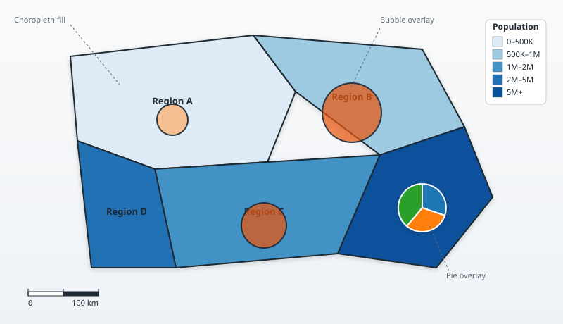
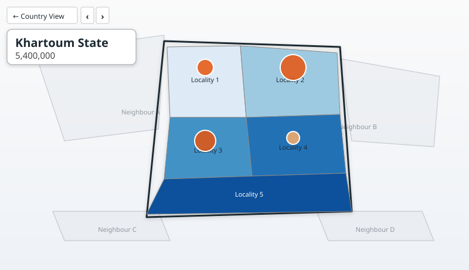

# AdminCartograph

A Power BI custom visual for **multi-layer subnational mapping**.
Choropleth fills, proportional bubbles, and pie / donut / column overlays
on top of administrative boundaries (Admin1 + Admin2). Bring your own
geometry — any GeoJSON or TopoJSON, with the property names mapped via
on-canvas dropdowns — or use one of the eight countries that ship inside
the visual for convenience.


## What it looks like

A typical render: choropleth fills, a few proportional bubbles, one
pie overlay, and a category legend.



After clicking an Admin1, the visual drills into that area's Admin2
children. The focused state's name and value are pulled to a top-left
title pill, neighbours dim, and prev / next arrows let you cycle through
states without going back to the country view.



Real screenshots from your own data go a long way — drop them into
`assets/screenshots/` and the README will pick them up:

| Suggested screenshot | Filename |
|---|---|
| Hero — choropleth + bubbles + labels (full canvas) | `assets/screenshots/01-hero.png` |
| Format pane with the 14 numbered cards | `assets/screenshots/02-format-pane.png` |
| All three layers active (choropleth + bubbles + donuts) | `assets/screenshots/03-three-layers.png` |
| Drill view — title pill + prev/next arrows | `assets/screenshots/04-drill.png` |
| Custom upload card with field-mapping dropdowns | `assets/screenshots/05-custom-upload.png` |
| PowerPoint slide with the exported A5 PNG inserted | `assets/screenshots/06-powerpoint.png` |

## Bring your own geometry

The headline feature: **upload any country's boundaries at runtime**.
The visual accepts both TopoJSON and GeoJSON, supports separate Admin1
and Admin2 files, and uses a friendly four-dropdown mapping flow so
you don't have to rename properties in your source data:

1. Set **Country** to *Custom (upload TopoJSON)* in the format pane.
2. The map canvas shows an upload card. Pick the Admin1 file (required)
   and the Admin2 file (optional). Both accept `.json`, `.topojson` and
   `.geojson`.
3. The visual reads every distinct property name from your features
   and pre-fills four dropdowns — Admin1 PCODE, Admin1 Name, Admin2
   PCODE, Admin2 Name — using fuzzy matches against common patterns
   (`ADM1_PCODE` / `pcode_1` / `gid_1` / `state_id` / etc.).
4. Confirm or override the field mapping, then click **Load map**.

The uploaded geometry is saved into the report's metadata via
`host.persistProperties` so it survives report save / reload. Each
MB of geometry adds about that much to the .pbix; ~5 MB total is a
comfortable practical ceiling.

This is the path most users should take — your country's boundaries
are exactly the version you want, your property names are honoured,
and nothing has to be rebuilt.

## Bundled countries (convenience only)

For quick starts and demos, the shipping `.pbiviz` also embeds eight
countries' Admin1 + Admin2 boundaries (165 + 1,772 features). The
country dropdown auto-detects from your bound PCODEs, or you can pick
one explicitly. None of this is required — Custom upload covers any
country, and you can build your own bundle from
`country-geojson/<ISO3>.geojson.zip` files.

| ISO | Country | Admin1 | Admin2 |
|-----|---------|-------|--------|
| AFG | Afghanistan | 34 provinces | 421 districts |
| COD | DR Congo | provinces | territories |
| HTI | Haiti | departments | communes |
| IRN | Iran | provinces | counties |
| LBN | Lebanon | governorates | districts |
| SDN | Sudan | 19 states | 189 localities |
| SYR | Syria | governorates | districts |
| YEM | Yemen | 21 governorates | 333 districts |

## Capabilities

- **Choropleth fill** — quantile / equal-interval / manual classification,
  automatic ramp from a base color or 5 user-defined class colors,
  optional "Treat 0 as no-data" mode, opacity slider.
- **Bubble overlay** — square-root scaling, min/max radius, opacity,
  stroke, per-position label placement (above / below / left / right /
  center of the bubble).
- **Pie / Donut / Column overlay** — driven by 2+ measures bound to a
  single role. Each measure becomes one slice / column. Independent
  category color palette and label placement.
- **Drill** — click an Admin1 to focus its Admin2 children. Prev / next
  arrows navigate alphabetically through Admin1 areas. "Country View"
  button returns to all-Admin1.
- **Cross-filter** — clicks submit selection through the host's
  `selectionManager`, so other visuals (tables, charts, slicers)
  respond to map clicks.
- **Filter-driven drill** — in Auto mode, when a slicer narrows the
  data to one Admin1 (or several Admin2 in one parent), the visual
  auto-drills into that focus.
- **Tooltips** — Admin1 + Admin2 names, color value, bubble value,
  any user-bound Tooltip fields, on every layer.
- **Three legends** — choropleth (vertical / horizontal), bubble size
  (vertical / horizontal / compact min-max), pie / column categories
  (vertical / horizontal). Stack into one rounded container when they
  share a corner.
- **Scale bar** — km or miles, latitude-aware, "nice round" distances,
  follows zoom.
- **Zoom + pan** — on-canvas zoom buttons, directional pad, mouse drag,
  mouse wheel. Off by default; enable in Map controls.
- **PNG / SVG export** — A5-landscape PNG (1748 × 1240 @ ~300 DPI) for
  PowerPoint paste, or portable SVG with inlined CSS for vector tools
  like Illustrator / Inkscape.
- **Rich label engine** — halo, italic, bold, decimals, K/M format,
  curved / straight / boundary placement, fit-to-shape, abbreviation,
  hide-on-overflow.

## Format pane (top-down flow)

1. **Map setup** — country dropdown, view mode, background, interaction
2. **Choropleth fill** — color mode, classification, breaks, opacity
3. **Bubble overlay** — size / color / label placement
4. **Pie / Column overlay** — type, categories, sizes
5. **Borders** — Admin1 / Admin2 stroke styling
6. **Admin1 labels**
7. **Admin2 labels — default view**
8. **Admin2 labels — drill view**
9. **Choropleth legend**
10. **Bubble legend**
11. **Pie / Column legend**
12. **Legend container** (shared frame styling)
13. **Scale bar**
14. **Map controls** (zoom / pan / export buttons)

## Data roles

| Role | Required | Used by |
|------|----------|---------|
| **Admin1 PCODE** | yes (or Admin2) | choropleth + bubble at Admin1 level |
| **Admin2 PCODE** | optional | choropleth + bubble at Admin2 level |
| **Color Value** | optional | choropleth fill |
| **Bubble Size** | optional | bubble overlay |
| **Glyph Values (pie / column)** | optional | pie / donut / column overlay (multi-measure) |
| **Label Value 2** | optional | overrides the auto-shown number in labels |
| **Label Text 1** | optional | overrides the area name shown in labels |
| **Tooltips** | optional | extra fields appended to every tooltip |

Bind at least one PCODE field to render. If only Admin1 PCODE is bound
(or your geometry has no Admin2), the visual stays in Admin1 mode and
clicks just cross-filter without drilling.

## Project layout

```
capabilities.json                  Power BI data role + objects schema
pbiviz.json                        Visual metadata
country-geojson/                   Drop fieldmaps.io <ISO>.geojson.zip files here for the bundle
src/
  visual.ts                        Entry point, lifecycle, layer composition
  settings.ts                      Strongly-typed formatting model
  data/dataConverter.ts            DataView -> AreaDatum map
  geo/geometryLoader.ts            Decodes embedded TopoJSON
  generated/countries.ts           AUTO-GENERATED dropdown options
  render/
    classification.ts              Quantile / equal / manual breaks + ramp
    choropleth.ts                  Polygon fills + borders
    bubbles.ts                     Bubble layer
    glyphs.ts                      Pie / donut / column overlay
    labels.ts                      Label engine
    labelPlacement.ts              Anchor helpers
    legend.ts                      Three legends + combined container
    scaleBar.ts                    Latitude-aware scale bar
    projection.ts                  d3.geoMercator + fitExtent
    format.ts                      Number formatter
scripts/
  sync-countries-from-geojson.js   Extracts country-geojson/*.zip -> countries.json
  build-topojson.js                Bundle builder + dropdown writer
  release-all.js                   Optional per-country builds
  fetch-geometry.js                Bulk fetch from fieldmaps.io
assets/
  geometry/world.topojson.json     Embedded geometry bundle (built artifact)
  geometry/country-index.json      Per-country bbox + counts
  icon.png                         Visual icon
  logo.png / logo.svg              Hi-res logo
  preview-layers.svg               Illustrative layer-stack diagram
  preview-drill.svg                Illustrative drill-view diagram
  screenshots/                     Drop your own report screenshots here
style/visual.less                  Visual styles
releases/
  AdminCartograph.pbiviz           Built visual, ready to import
```

## Build prerequisites

- Node.js 18+
- `pbiviz` CLI (`npm i -g powerbi-visuals-tools@5.4.0`)
- A Power BI Pro / PPU account if you want to upload to a workspace

## Build the visual

```bash
npm install
npm run release
```

This runs the sync + topojson build + pbiviz package in one step.

## Adding bundled countries (optional)

The Custom upload flow handles any country at runtime. If you'd rather
bake a country into the bundle so report users don't have to upload:

```bash
# 1. Drop a fieldmaps.io zip into the folder, named <ISO3>.geojson.zip
cp ~/Downloads/KEN.geojson.zip country-geojson/

# 2. Rebuild
npm run release

# 3. Import the new releases/AdminCartograph.pbiviz
```

Power BI's ~50 MB visual cap fits 50+ countries at the default
simplification. If you need more:

```bash
node scripts/build-topojson.js --simplify 0.001 --quantize 5000
```

## Using the visual in a report

1. Add the visual to the report.
2. Bind any of:
   - **Admin1 PCODE** — required for an Admin1 choropleth
   - **Admin2 PCODE** — adds drill / locality view
3. Optional bindings: **Color Value**, **Bubble Size**, **Glyph Values**
   (multiple measures), **Label Value 2**, **Label Text 1**, **Tooltips**.
4. In the format pane → **1. Map setup**:
   - **Country**: pick a bundled country, leave on Auto-detect (uses
     PCODE prefix), or pick **Custom** to upload your own geometry.
   - **View mode**: Auto / Admin1 / Admin2.

## Notes / limitations

- Curved label placement uses a quadratic Bezier approximation; full
  text-on-medial-axis is on the roadmap.
- Cross-filter on click submits selection through the host's
  `selectionManager`. If interaction is disabled, clicks no longer
  drill or filter (tooltips still work).
- PNG export depends on the host allowing canvas serialisation; falls
  back to a download in environments where canvas is restricted.

## License

ISC. The bundled OCHA Common Operational Datasets carry their own
licensing terms — see <https://fieldmaps.io/data/cod/> and the OCHA HDX
licence per country.
